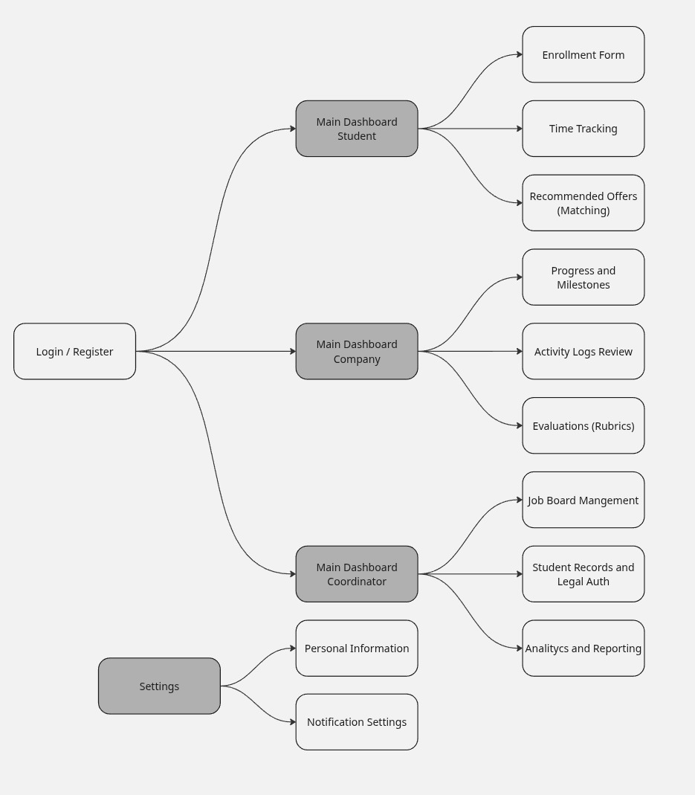

# Internship UX
UX design repository for a centralized internship management platform, focusing on streamlining administrative workflows, tracking progress, and enhancing the interaction between students and supervisors through user-centered interfaces.

## Index
- [1. Introduction](#1-introduction)
   - [1.1. The Problem](#11-the-problem)
   - [1.2. The Solution](#12-the-solution)
- [2. Team](#2-team)
- [3. Strategy](#3-strategy)
   - [3.1. Value Proposition Canvas](#31-value-proposition-canvas)
   - [3.2. UIX Persona](#32-uix-persona)
   - [3.3. Benchmarking](#33-benchmarking)
- [4. Scope](#4-scope)
   - [4.1. Customer Journey Map](#41-customer-journey-map)
- [5. Structure](#5-structure)
   - [5.1. Navigation Flow](#51-navigation-flow)
- [6. Skeleton](#6-skeleton)
   - [6.1. Low-Fi Wireframes](#61-low-fi-wireframes)
- [7. Surface](#7-surface)
   - [7.1. Interface Evolution](#71-interface-evolution)
   - [7.2. Results of the Heuristic Evaluation](#72-results-of-the-heuristic-evaluation)
   - [7.3. High Definition Interfaces](#73-high-definition-interfaces)

## 1. Introduction

### 1.1. The Problem

Administrative fragmentation and the lack of a centralized channel for internship monitoring force students and supervisors to navigate multiple platforms and emails. This dispersion creates a high administrative workload, a loss of traceability in report submissions, and delays in hour validation, turning an academic process into a bureaucratic bottleneck that hinders direct communication and the real-time fulfillment of evaluative milestones.

### 1.2. The Solution
A centralized "matchmaking" platform designed exclusively for Civil Computer Engineering students at the Universidad de La Frontera (UFRO). The platform streamlines the connection between students looking for internships and companies offering positions, all overseen by a University Administrator.

- Smart Matchmaking: An interface inspired by modern discovery apps that connects student profiles (skills/interests) with available internship offers.
- Centralized Workflow: Handles everything from the initial "match" to document signing, weekly progress reports, and final evaluations.
- Three-Way Dashboard: Dedicated flows for Students, Company Supervisors, and the UFRO Internship Director.
  
## 2. Team

- Arturo Avalos
- Benjamin Fernandez
- Christian Gajardo
- Maximiliano Sepulveda 

## 3. Strategy

### 3.1. Value Proposition Canvas

This canvas illustrates the strategic alignment between the platform’s features and the actual needs of the academic community. By identifying the heavy administrative burden and information scattering as primary pain points, the solution focuses on centralizing workflows through automated time logging and unified document management. The value lies in transforming a fragmented, email-dependent process into a transparent, real-time ecosystem that ensures data integrity and reduces the operational friction for students, supervisors, and university coordinators alike.

### 3.2. UIX Persona

This tool allowed us to build detailed profiles of the key stakeholders interacting with the platform, taking into account aspects such as:

 - Demographic data: Age, role (student, supervisor, or coordinator), and location.

 - Goals: What they hope to achieve, such as securing high-impact internships, centralizing student traceability, or providing efficient technical mentoring.

 - Frustrations: Current problems like lack of transparency in job postings, job "ghosting," manual bureaucracy, and administrative chaos.

 - Needs and motivations: The search for a solution that automates validations, provides real-time reporting, and simplifies the institutional agreement process.

The Persona Canvas helped us clearly represent the behaviors and expectations of our users, making it easier to design an experience that directly responds to the need for professionalizing and streamlining the internship ecosystem.

### 3.3. Benchmarking

## 4. Scope

### 4.1. Customer Journey Map

## 5. Structure

### 5.1. Navigation Flow

The navigation architecture is designed as a role-based ecosystem, ensuring a streamlined experience for each user type. Upon authentication, the system branches into three distinct dashboards: Student, Company, and Coordinator, each housing its specific operational tools—from time tracking and rubrics to legal authorizations. This structure minimizes cognitive load by isolating role-specific tasks, while a global Settings module provides unified access to profile and notification management, ensuring a cohesive and efficient user journey across the entire internship lifecycle.

## 6. Skeleton

### 6.1. Low-Fi Wireframes

## 7. Surface

### 7.1. Interface Evolution

### 7.2. Results of the Heuristic Evaluation

### 7.3. High Definition Interfaces
