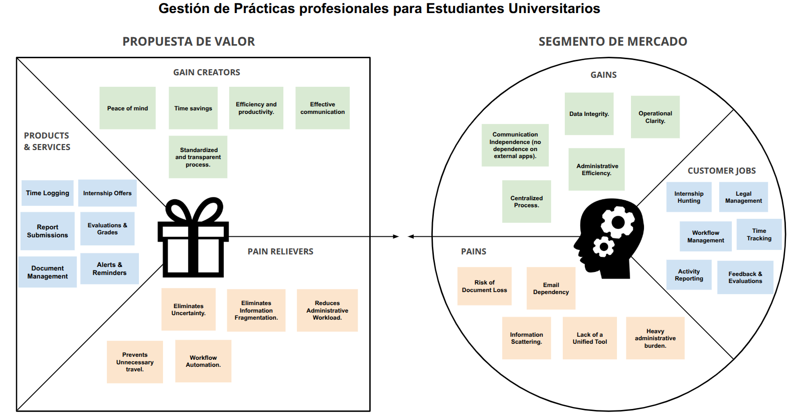

# Internship UX
UX design repository for a centralized internship management platform, focusing on streamlining administrative workflows, tracking progress, and enhancing the interaction between students and supervisors through user-centered interfaces.

## Index
- [1. Introduction](#1-introduction)
   - [1.1. The Problem](#11-the-problem)
   - [1.2. The Solution](#12-the-solution)
- [2. Team](#2-team)
- [3. Strategy](#3-strategy)
   - [3.1. Value Proposition Canvas](#31-value-proposition-canvas)
   - [3.2. UIX Persona](#32-uix-persona)
   - [3.3. Benchmarking](#33-benchmarking)
- [4. Scope](#4-scope)
   - [4.1. Customer Journey Map](#41-customer-journey-map)
- [5. Structure](#5-structure)
   - [5.1. Navigation Flow](#51-navigation-flow)
- [6. Skeleton](#6-skeleton)
   - [6.1. Low-Fi Wireframes](#61-low-fi-wireframes)
- [7. Surface](#7-surface)
   - [7.1. Interface Evolution](#71-interface-evolution)
   - [7.2. Results of the Heuristic Evaluation](#72-results-of-the-heuristic-evaluation)
   - [7.3. High Definition Interfaces](#73-high-definition-interfaces)

## 1. Introduction

### 1.1. The Problem

Administrative fragmentation and the lack of a centralized channel for internship monitoring force students and supervisors to navigate multiple platforms and emails. This dispersion creates a high administrative workload, a loss of traceability in report submissions, and delays in hour validation, turning an academic process into a bureaucratic bottleneck that hinders direct communication and the real-time fulfillment of evaluative milestones.

### 1.2. The Solution

## 2. Team

- Arturo Avalos
- Benjamin Fernandez
- Christian Gajardo
- Maximiliano Sepulveda 

## 3. Strategy

### 3.1. Value Proposition Canvas

This canvas illustrates the strategic alignment between the platform’s features and the actual needs of the academic community. By identifying the heavy administrative burden and information scattering as primary pain points, the solution focuses on centralizing workflows through automated time logging and unified document management. The value lies in transforming a fragmented, email-dependent process into a transparent, real-time ecosystem that ensures data integrity and reduces the operational friction for students, supervisors, and university coordinators alike.

### 3.2. UIX Persona

### 3.3. Benchmarking

## 4. Scope

### 4.1. Customer Journey Map

## 5. Structure

### 5.1. Navigation Flow

## 6. Skeleton

### 6.1. Low-Fi Wireframes

## 7. Surface

### 7.1. Interface Evolution

### 7.2. Results of the Heuristic Evaluation

### 7.3. High Definition Interfaces
