# InterTrack
UX design repository for a centralized internship management platform, focusing on streamlining administrative workflows, tracking progress, and enhancing the interaction between students and supervisors through user-centered interfaces.

## Index
- [1. Introduction](#1-introduction)
   - [1.1. The Problem](#11-the-problem)
   - [1.2. The Solution](#12-the-solution)
- [2. Team](#2-team)
- [3. Strategy](#3-strategy)
   - [3.1. Value Proposition Canvas](#31-value-proposition-canvas)
   - [3.2. UIX Persona](#32-uix-persona)
   - [3.3. Benchmarking](#33-benchmarking)
- [4. Scope](#4-scope)
   - [4.1. Customer Journey Map](#41-customer-journey-map)
- [5. Structure](#5-structure)
   - [5.1. Navigation Flow](#51-navigation-flow)
- [6. Skeleton](#6-skeleton)
   - [6.1. Low-Fi Wireframes](#61-low-fi-wireframes)
- [7. Surface](#7-surface)
   - [7.1. Interface Evolution](#71-interface-evolution)
   - [7.2. Results of the Heuristic Evaluation](#72-results-of-the-heuristic-evaluation)
   - [7.3. High Definition Interfaces](#73-high-definition-interfaces)

## 1. Introduction

### 1.1. The Problem

Administrative fragmentation and the lack of a centralized channel for internship monitoring force students and supervisors to navigate multiple platforms and emails. This dispersion creates a high administrative workload, a loss of traceability in report submissions, and delays in hour validation, turning an academic process into a bureaucratic bottleneck that hinders direct communication and the real-time fulfillment of evaluative milestones.

### 1.2. The Solution

The solution is a centralized mobile app designed exclusively for Civil Computer Engineering students at the Universidad de La Frontera (UFRO), which eliminates administrative fragmentation by unifying the entire internship lifecycle into a single, 100% trackable digital environment. To directly address the loss of traceability and bureaucratic bottlenecks, the app integrates a workflow managed through a synchronized dashboard for the three key roles: Students, Company Supervisors, and the University Coordinator. This unified channel not only streamlines the initial connection (or match) between student profiles and IT job offers, but also guarantees real-time visibility over document signing, automatic hour validation, and the fulfillment of evaluative milestones, ensuring transparent and direct communication from start to finish.
  
## 2. Team

- Arturo Avalos – Project Manager: Responsible for the overall coordination and planning of the project. Ensures that deadlines are met, organizes team activities, coordinates meetings, and leads presentations. Also supervises the integration of all deliverables to maintain consistency throughout the project.
- Benjamin Fernandez – UX Research Analyst: Responsible for conducting user research and analyzing collected information. Develops UX Personas, Customer Journey Maps, and the Value Proposition Canvas. Identifies user needs, pain points, and opportunities to improve the proposed solution.
- Christian Gajardo – UI/UX Designer: Responsible for designing the user experience and user interface. Creates low-fidelity and high-fidelity prototypes, designs navigation flows, and ensures visual consistency across all screens. Applies usability and accessibility principles throughout the design process.
- Maximiliano Sepulveda – Documentation and Repository Manager : Responsible for organizing and maintaining the project repository. Ensures that all documentation is complete, properly structured, and written in English. Manages deliverables, annexes, and supporting materials while maintaining quality standards and version control.

## 3. Strategy

### 3.1. Value Proposition Canvas

This canvas illustrates the strategic alignment between the platform’s features and the actual needs of the academic community. By identifying the heavy administrative burden and information scattering as primary pain points, the solution focuses on centralizing workflows through automated time logging and unified document management. The value lies in transforming a fragmented, email-dependent process into a transparent, real-time ecosystem that ensures data integrity and reduces the operational friction for students, supervisors, and university coordinators alike.

### 3.2. UIX Persona

This tool allowed us to build detailed profiles of the key stakeholders interacting with the platform, taking into account aspects such as:

 - Demographic data: Age, role (student, supervisor, or coordinator), and location.

 - Goals: What they hope to achieve, such as securing high-impact internships, centralizing student traceability, or providing efficient technical mentoring.

 - Frustrations: Current problems like lack of transparency in job postings, job "ghosting," manual bureaucracy, and administrative chaos.

 - Needs and motivations: The search for a solution that automates validations, provides real-time reporting, and simplifies the institutional agreement process.

The Persona Canvas helped us clearly represent the behaviors and expectations of our users, making it easier to design an experience that directly responds to the need for professionalizing and streamlining the internship ecosystem.

### 3.3. Benchmarking

The current university management process relies on three disconnected tools. **Google Forms** collects data across five isolated stages, forcing users to constantly repeat the exact same information in generic formats. **Gmail** functions as the main communication channel, where crucial links and documents get lost in cluttered inboxes, causing severe uncertainty and delays. Finally, **Looker Studio** acts like a "black box"—it is a static visual dashboard exclusive to coordinators that leaves the student completely in the dark regarding their progress and lacks any functionality to manage or approve requests directly on screen.

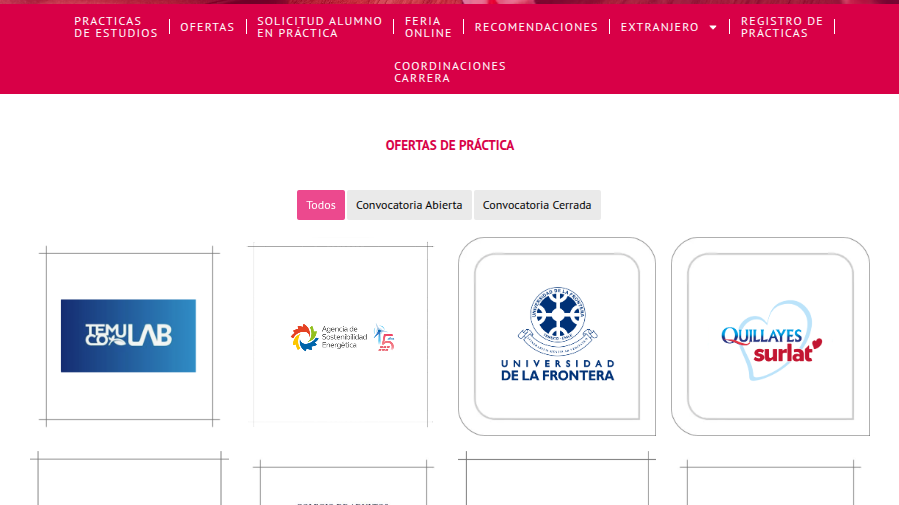

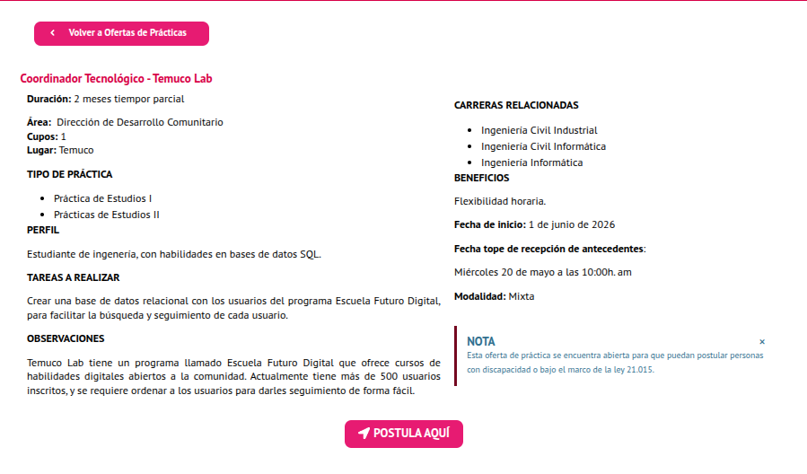

On the other hand, the **FICA Web** (fica.ufro.cl) acts as a public job board. Although in practice it is not the exclusive or most used platform for students to find an internship, it remains the official channel and follows the faculty's most standardized operating model. Its main drawback is that it mixes job offers from all engineering fields, and attempting to apply redirects the user to external forms or emails, breaking the workflow. However, its baseline structure is an excellent data source and the perfect foundation to clean up, improve, and integrate as a built-in search engine 100% focused on the IT sector.

To understand how to solve this fragmentation, we evaluated two major benchmarks utilized in the university and professional environment: **Reqlut** and **GoSprout**.

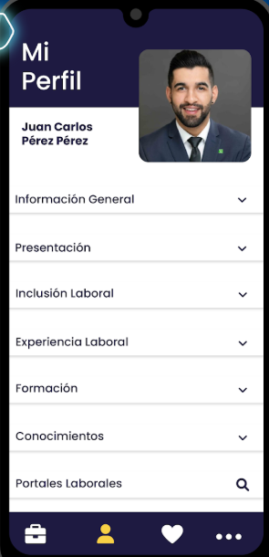 | 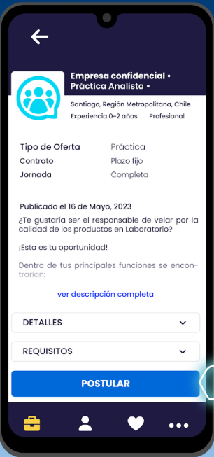 | 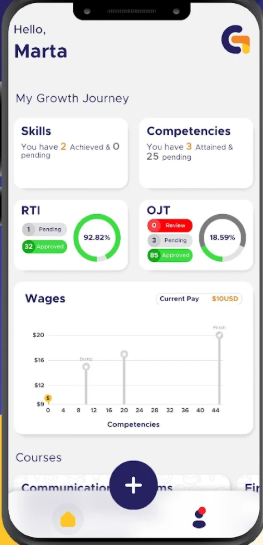

* **Reqlut:** Widely adopted by Chilean universities, it stands out for providing an excellent user experience by allowing students to build modular profiles and apply to job openings directly with a single click. However, it completely overlooks the follow-up and tracking of the internship once the work placement actually begins.
* **GoSprout:** This international application excels at hour tracking and milestone monitoring step-by-step through clear visual indicators (such as radial charts and status labels), but it lacks an integrated job search engine or placement matching.

**Intertrack** bridges this gap by combining the best of both worlds into a single mobile application: quick profile-based applications and real-time progress monitoring.

Based on the diagnostic of the current tools and the analyzed benchmarks, we defined our user-centered design strategy using four action pillars:

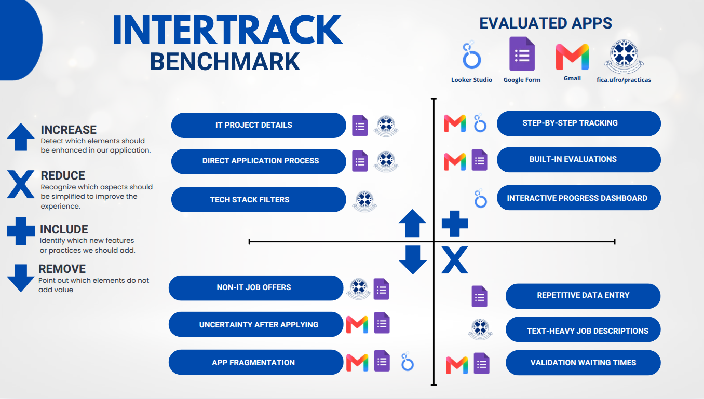

#### Increase
We aim to increase features focused exclusively on the IT sector. Since current university forms and websites target all engineering majors, we will add specific fields to detail the programming languages, tech stacks, and frameworks that will be used during the internship. We will also increase search precision through advanced technical filters, allowing students to apply with a single click using their saved profile.

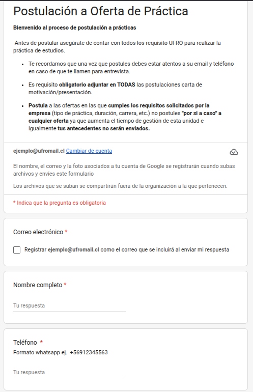

#### Reduce
It is critical to reduce repetitive paperwork and administrative delays. Currently, the student, the company supervisor, and the coordinator must manually type their names, National ID (RUT), and emails across five different forms; Intertrack will automate data persistence. Additionally, we will reduce overly long, unstructured job descriptions through standardized templates and minimize the waiting times caused by the process depending on manual email replies.

#### Include
We will include key features currently missing from the UFRO ecosystem to eliminate uncertainty. Instead of a Looker Studio dashboard that only coordinators can access, we will include an interactive, visual progress bar so students know exactly who has their paperwork and what step is missing. Furthermore, we will integrate a native evaluation module so both supervisors and students can submit grades directly within the app without waiting for external links via email.

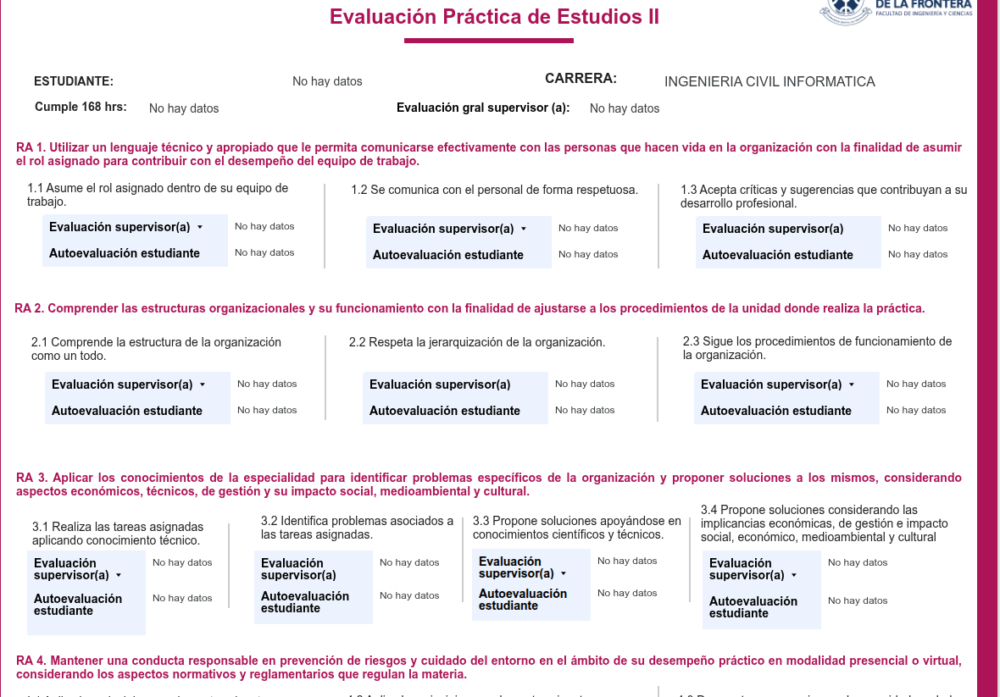

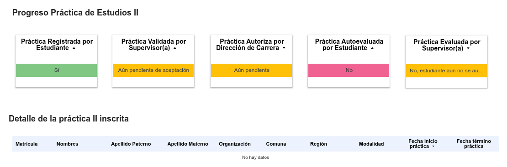

#### Eliminate
Finally, we will eliminate elements that confuse and slow down users. This means completely filtering out job offers from other engineering fields that provide no value to computer science students. We will also eliminate the lack of feedback when submitting documents by replacing traditional email communication with automated in-app notifications. In short, we eliminate the need for four separate platforms so that all three key roles can seamlessly interact in one centralized workspace.

Synthetic Comparative Table

The following matrix consolidates the mandatory baseline dimensions alongside domain-specific criteria tailored to our IT internship scope:

| Evaluation Dimension | Current UFRO Process (Forms + Gmail) | Competitor A: Reqlut | Competitor B: GoSprout | Our Proposed Solution: **Intertrack** |
| :--- | :--- | :--- | :--- | :--- |
| **Target Audience** | UFRO Engineering students, supervisors, and coordinators. | Broad university student base and multi-industry recruiters. | Vocational trainees, program managers, and field supervisors. | **Computer Science & IT students, tech companies, and academic coordinators.** |
| **Main Value Proposition** | Manual validation of academic graduation requirements. | Multi-purpose job-board and applicant matching portal. | Administrative compliance and on-the-job hours auditing. | **End-to-end mobile automation, technical matching, and real-time step monitoring.** |
| **Onboarding Flow** | Disconnected. Starts manually via external Google Forms links. | Multi-step personal resume builder with manual text inputs. | Private registration via institutional invitation link. | **Instant integration leveraging pre-existing UFRO intranet credentials.** |
| **Primary UI Navigation** | No layout pattern. Fragmented web-links and emails. | Bottom tabs paired with classic hierarchical text list details. | Bottom navbar combined with a central persistent FAB. | **Intuitive bottom navigation combined with a linear step-by-step milestone timeline.** |
| **Domain Dimension 1: Technical Stack/IT Filters** | **None.** Job board mixes all engineering fields randomly. | **None.** Uses generic keyword search bars with no tech filter fields. | **None.** Focuses purely on general vocational hour-tracking metrics. | **Advanced tags filtering by programming languages, frameworks, and roles.** |
| **Domain Dimension 2: 3-Way Sync Compliance** | **Fragmented.** Done manually by typing data into 5 separate forms. | **Partial.** Connects application but lacks post-hire tools. |  **Full.** Real-time automated verification loops. | **Centralized. In-app document synchronization for Student, Boss, and University.** |

---

Findings and Design Decisions

Analyzing the domain standards revealed critical design patterns that **Intertrack** will adopt or systematically redefine:

1. **Adoption of Collapsible Modular Profiles (from Reqlut):** We will implement a structured, persistent profile framework to eliminate data duplication. Students input personal and academic details once, which then automatically populates future validation steps.
2. **Adoption of Radial Progress Indicators (from GoSprout):** To dismantle the current "black box" experience of Looker Studio, we are adopting explicit status tracking labels and visual indicators. This ensures students get clear feedback on exactly who is reviewing their paperwork.
3. **Rejection of Complex Corporate Dashboard Data (from GoSprout):** We are purposefully omitting complex financial graphs or multi-tiered corporate apprentice wage trackers to maintain a minimalist, accessible interface centered around UFRO's academic requirements.

**Intertrack** effectively bridges this market gap by merging the search and matching capabilities of **Reqlut** with the visual tracking and administrative feedback loop of **GoSprout** into a single mobile environment.

## 4. Scope

### 4.1. Customer Journey Map

## 5. Structure

### 5.1. Navigation Flow

The navigation architecture is designed as a role-based ecosystem, ensuring a streamlined experience for each user type. Upon authentication, the system branches into three distinct dashboards: Student, Company, and Coordinator, each housing its specific operational tools—from time tracking and rubrics to legal authorizations. This structure minimizes cognitive load by isolating role-specific tasks, while a global Settings module provides unified access to profile and notification management, ensuring a cohesive and efficient user journey across the entire internship lifecycle.

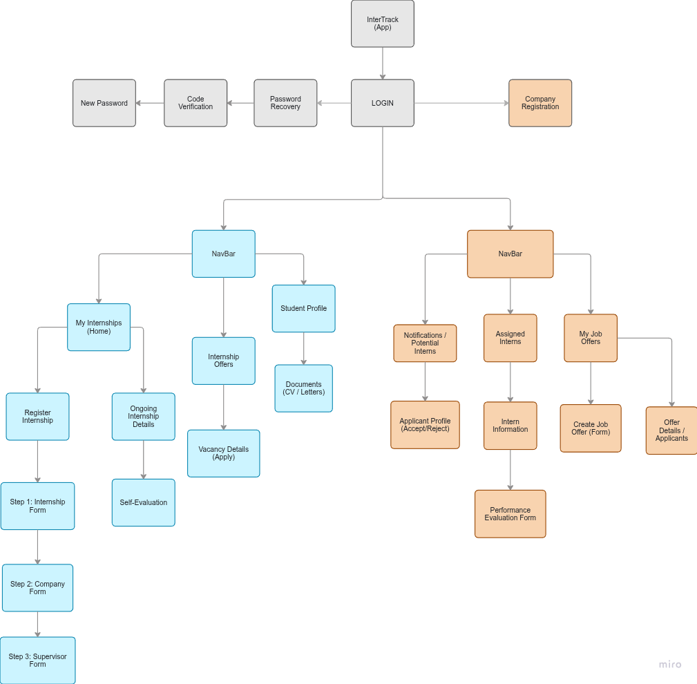

## 6. Skeleton

### 6.1. Low-Fi Wireframes

The wireframes are focused on 3 different user roles, who share emails and collaborate when starting, advancing, and finalizing an internship:

#### 1. Intern (Student)
* View the general status of all their internships.
* View internship details and history tracking.
* Browse internship offers to apply, or register an external internship.

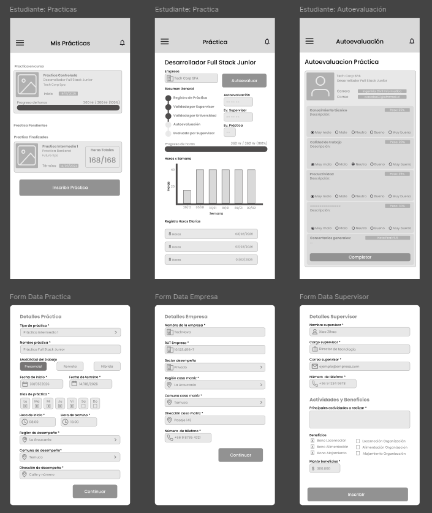 

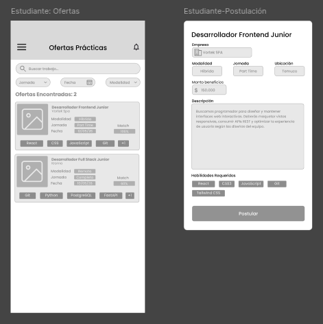

#### 2. Academic Coordinator
* Authorize internships.
* View detailed information about students currently enrolled in internships.
* Evaluate completed internships.

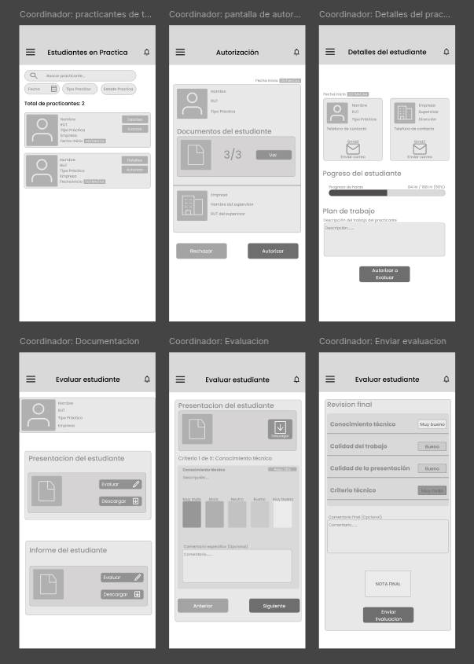

#### 3. Supervisors
* Post internship opportunities for students.
* Track the progress and status of their interns.
* Evaluate at the end of the internship and close the cycle.

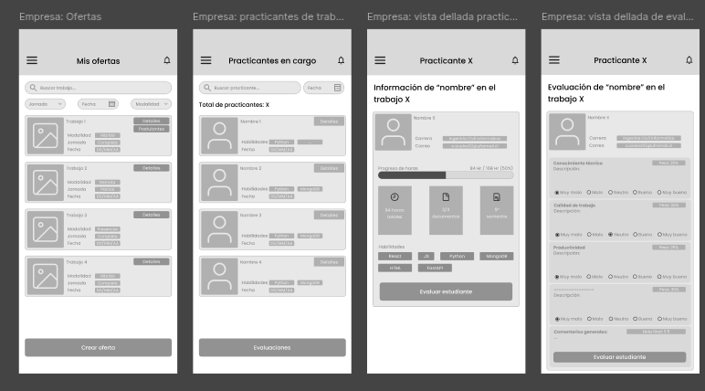

All Low-Fi Wireframes can be seen here: [Figma](https://www.figma.com/design/xn8Vwx0Js6ZoTdfAgoNmRJ/Wireframes?node-id=0-1&p=f&t=0ggaOzU6UwhOb6P5-0)

## 7. Surface

### 7.1. Interface Evolution

### 7.2. Results of the Heuristic Evaluation

### 7.3. High Definition Interfaces
